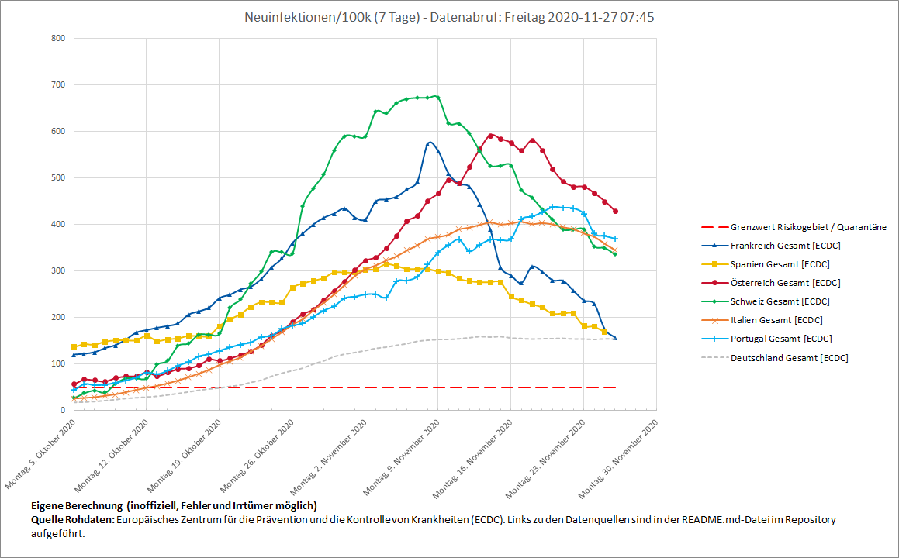

# Visualization of new covid-19 cases within last 7 days for selected contries
The `update-xlsx.ps1` script collects covid-19 data from the `European Centre for Disease Prevention and Control` (`ECDC`) and updates the `7d-corona.xlsx` file accordingly. Excel is used for easy visualization of the data.

Intent: A quarantine is currently required when returning to germany if in the country of origin, there have been more than 50 new infections per 100k inhabitants within the last seven days. German RKI does provide a prebuilt plot of this metric.

Keep in mind: the inofficial calculations used by this repository are not relevant for officials, but the data gathered by RKI! Therefore, the data visualized by `7d-corona.xlsx` can only be an indicator! **Ultimately relevant are the [values published by german RKI](https://www.rki.de/DE/Content/InfAZ/N/Neuartiges_Coronavirus/Risikogebiete_neu.html) and the state of living (e.g. [Baden-Württemberg](https://sozialministerium.baden-wuerttemberg.de/de/gesundheit-pflege/gesundheitsschutz/infektionsschutz-hygiene/informationen-zu-coronavirus/verordnungen/risikogebiete/)).**

## Data sources
## European Centre for Disease Prevention and Control (ECDC)
 - Covid-19 cases are extracted from [ecdc's csv downloadable data set](https://www.ecdc.europa.eu/en/publications-data/download-todays-data-geographic-distribution-covid-19-cases-worldwide)
 - population data for 2018 contained in above csv data set is used for calculations

## Requirements
 - Powershell v5
 - Excel 2016 (other versions are likely to work as well)
 
## How To
 1. Make sure `7d-corona.xlsx` is not opened
 2. Run powershell script `update-xlsx.ps1`
 3. Open `7d-corona.xlsx` to view the collected data
 
## Git Setup
Before commiting to this repository, [_setup.sh](_setup.sh) should be run to
setup a [git smudge filter](https://www.git-scm.com/docs/gitattributes#_filter),
that decompresses `xlsx` files during commit: `xlsx` files are zip compressed
archives of mostly `xml` formatted plaintext files. Git's delta compression
works very well for xml files, but not if compressed. For security reasons, the
filter needs to be configured explicitly. Therefore, it cannot be shared in a
way that does need user interaction. Decompressing is done using compression
level `store` which preserves full FreeCAD compatibility. A clean filter is not
used, therefore files in working tree are slightly bigger after checkout
compared with the initial file size.
